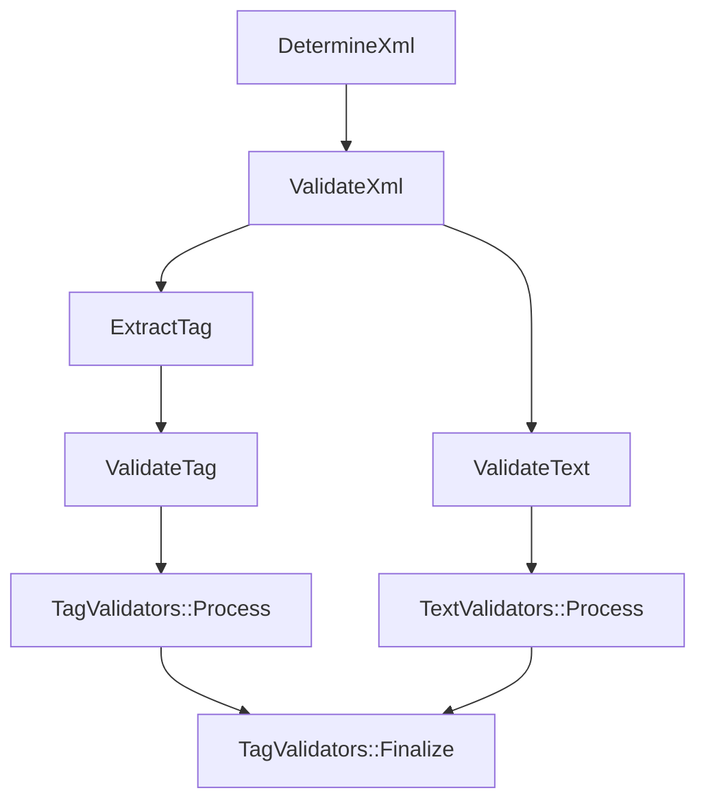
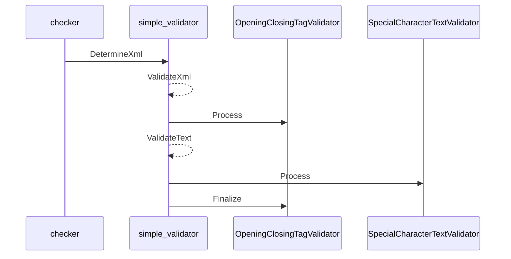

# XML Validator
---

### Overview

This repository contains a C++ project aimed at validate xml input. Most of the tag attribute parsing are ignore for simplicity. Please refer to the test case found in `checker.cpp`. 

### Files & Directory

1. **main.cpp**: 
   - Description: This file contains the main entry point of the application.
  
2. **tag.{hpp,cpp}**:
   - Description: Contains various tag representation and its revelant operations

3. **text_validtator/**:
   - Description: Implementations for validating text section only

4. **tag_validtator/**:
   - Description: Implementations for validating the tags only

5. **simple_validator.hpp**:
   - Description: api function `DetermineXml` for validating xml 

6. **checker.cpp**
   - Description: contains all the different test cases 

### Function Design
----
#### `bool ValidateXml(const std::string& input, TagValidator tag_validator, TextValidator text_validator)`

- **Description**: This is the core function for processing the xml string and performs necessary validation. It can be found in `simple_validator_impl.hpp`. User can simply call `DetermineXml` to validate the input. This method provide extensibility for user to vary the different tag and text validation strategy without changing the api
  
- **Parameters**:
  - `input`: xml string to be processed
  - `tag validator`: used to validate all tags, this is an interface that allows developer to vary its implementation
  - `text_validator`: used to validate text section, this is an interface that allows developer to vary its implementation
  
- **Return**: `bool`: true if it is a valid xml
- **Usage**:
  ```cpp
  // user can simply add a UserDefinedTagValidator validator as shown below for second parameter
  
  // as for third parameter SpecialCharacterTextValidator, user may follow implementation in TagValidators `tag_validators.hpp` to wrap all the text validators

  // DetermineXml is just an api to delegate the call for xml validation
  
  inline bool DetermineXml(const std::string& input) {

  return ValidateXml(
      input,
      TagValidators{OpeningClosingTagValidator{}, UserDefinedTagValidator, ...},
      SpecialCharacterTextValidator{});
    }

- **Sample Usage for extending TagValidator**
  ```cpp
  // the class must contains Process and Finalize method shown below with the same parameter and return type
  
  class UserDefinedTagValidator {
  public:
    bool Process(const Tag& tag);
    bool Finalize() const;
  };

- **Sample Usage for extending TextValidator**
  ```cpp
  // the class must contains Process with the same parameter and return type
  
  class UserDefinedTextValidator {
  public:
    bool Process(std::string_view input);
  };

#### `Tag ExtractTag(std::string_view input)`
This is a factory function for extracting tag from the given xml input view. It can only extract 1 tag at a time. User may add in additional new tag within this implementation

- **Here are the available tags** `tag.hpp`
  - InvalidTag: just a placeholder to represent error tag will extracted
  - OpeningTag: `<sample>`
  - ClosingTag: `</sample>`
  - MarkupTag: `<!sample>`
  - SelfClosingTag: `<sample/>`
  - CDataTag: `<![CDATA[]]>`

- **Sample Usage for creating a new Tag type**

  ```cpp
  // take note that the tag string view does not contains opening and closing delimiter <>

  class UserDefinedTag: public BaseTag {
  public:
    explicit UserDefinedTag(std::string_view tag): BaseTag{tag} {}
  };


### Function Flow Diagram


### Sequence Diagram
